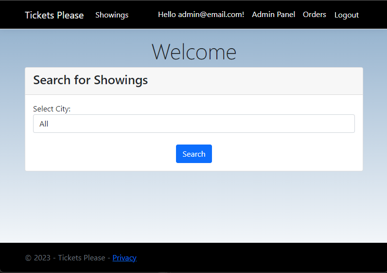
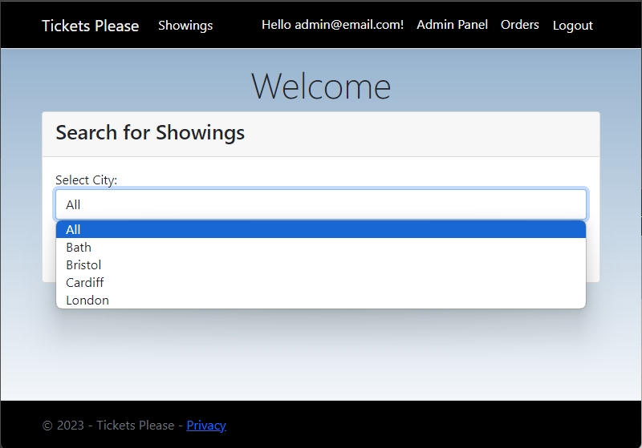
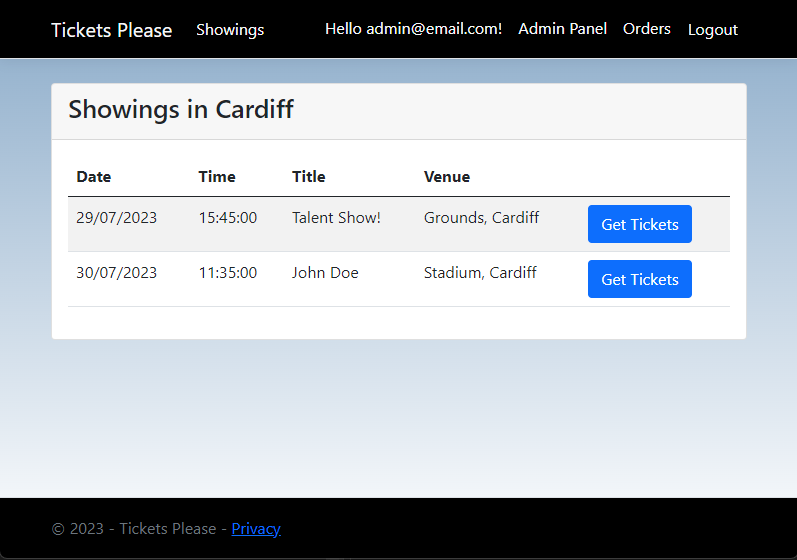
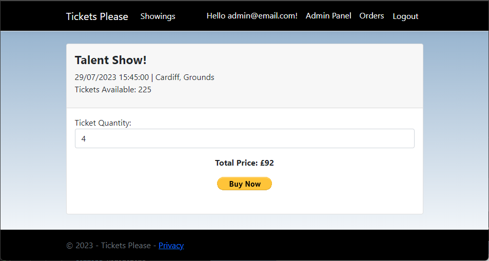
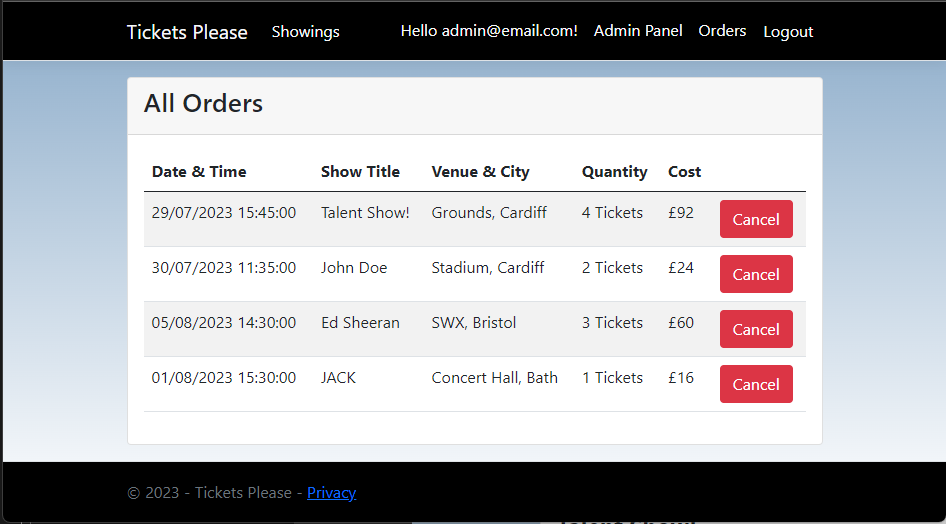
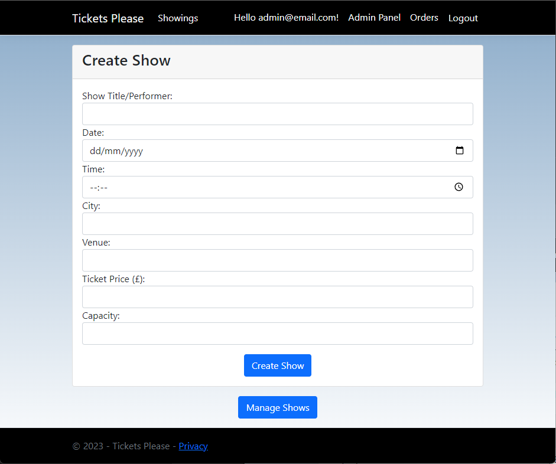
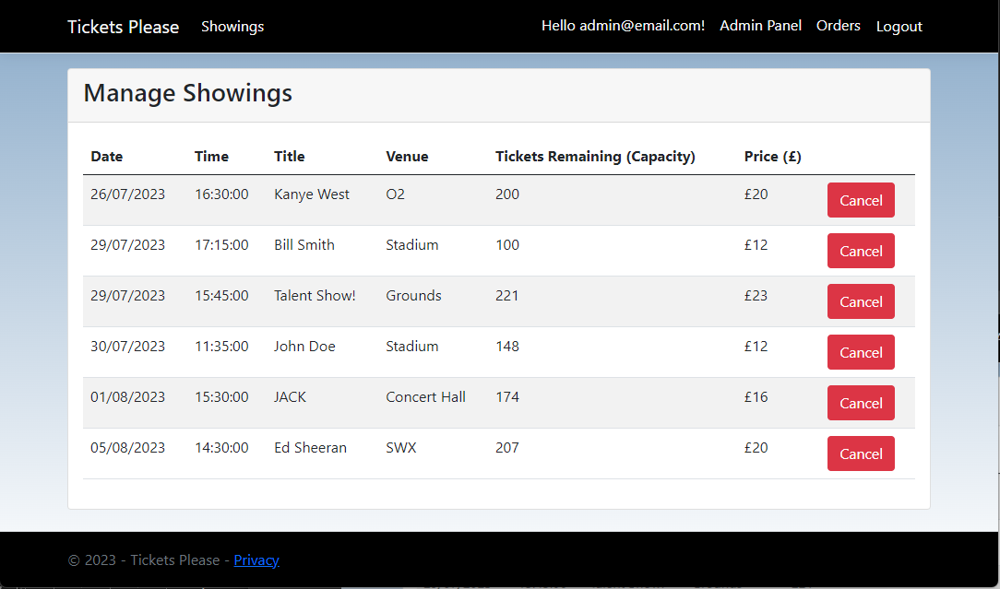

# Tickets-Please

This project was created with the primary purpose of learning the ASP.NET ecosystem. I learned how to develop **ASP.NET** applications with **Razor** pages (similar to the MVC architecture), **Microsoft SQL Server (MS SQL)** for developing the database, and **Microsoft Identity** for a comprehensive authentication system.

Tickets Please is a website for purchasing tickets for live shows. Admins will create live shows for customers to book and customers can purchase tickets for the available shows (if they aren't sold out).

Customers can manage the orders they make (cancel their order) and admins can manage/cancel shows.

**Requirements to use application:**
* The database may have to be set up and is not included with the project, however the SQL code for the tables can be seen here: **databasecode.txt**
* Only one admin account is available and is only for the fake email: **admin@email.com**. 
Just simply make an account with that email and admin privilages are automatically granted. Any other email used will default to the customer role.

**TODO:**
* Allow customers to modify their orders (change number of tickets, etc).
* Allow admins to modify shows (any of the show's details).
* Allow admins to assign the admin role to default users (for adding more admins).

## Screenshots
### Customer

### Admin

